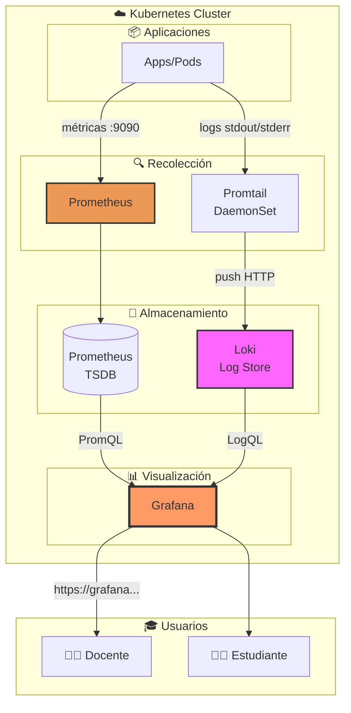
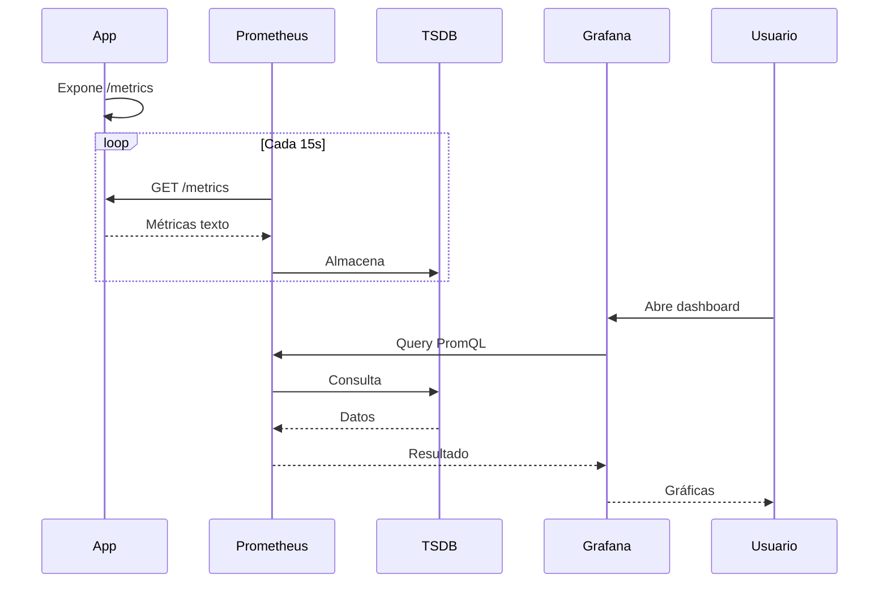
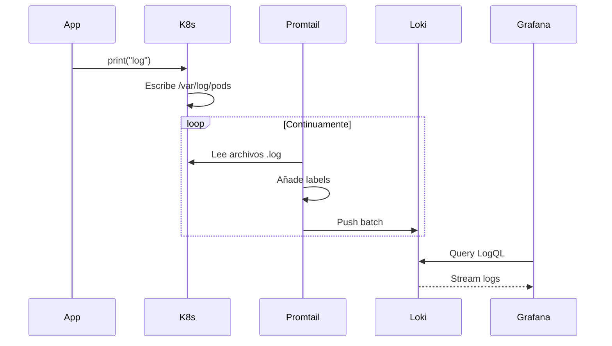
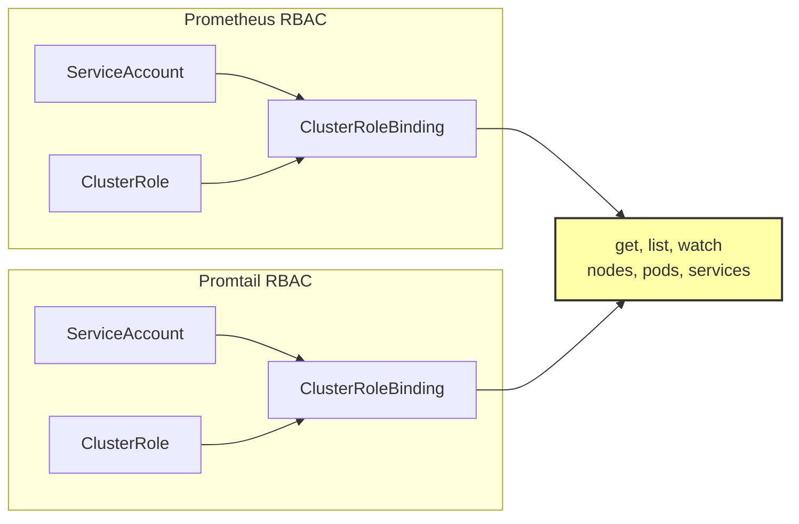
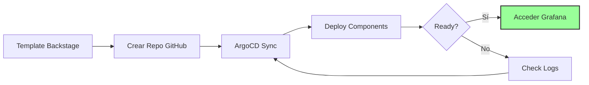

# Stack de Observabilidad para Kubernetes
## Guía Educativa - Prometheus, Loki y Grafana

---

## 📚 Introducción

Este stack proporciona una plataforma completa de **observabilidad** diseñada para enseñar los conceptos fundamentales del monitoreo en sistemas distribuidos. Implementa los tres pilares principales:

- 📊 **Métricas** → Prometheus (datos numéricos en el tiempo)
- 📝 **Logs** → Loki + Promtail (eventos y registros)
- 📈 **Visualización** → Grafana (dashboards interactivos)

### 🎯 Objetivos de Aprendizaje

Los estudiantes aprenderán:
- Cómo funcionan los sistemas de monitoreo en producción
- Recolección y análisis de métricas de aplicaciones
- Centralización y consulta de logs distribuidos
- Creación de dashboards y alertas
- Técnicas de debugging usando observabilidad

---

## 🏗️ Arquitectura General



---

## 🔧 Componentes Principales

### 1. 📊 Prometheus - Sistema de Métricas

**¿Qué hace?** Recolecta métricas numéricas de aplicaciones e infraestructura cada 15 segundos.

**Configuración:**
- 🔄 **Réplicas:** 2 (alta disponibilidad)
- 🔌 **Puerto:** 9090
- 🎯 **Modelo:** Pull (Prometheus consulta activamente)
- 💾 **Storage:** Time Series Database (TSDB)
- 🔋 **Recursos:** 250m CPU / 256Mi RAM → 1 CPU / 512Mi

**Fuentes de métricas configuradas:**

| Job | Descripción | Métricas |
|-----|-------------|----------|
| `kubernetes-cadvisor` | Contenedores | CPU, memoria, red, disco |
| `kubernetes-nodes` | Nodos | Salud de kubelet |
| `kube-state-metrics` | Estado K8s | Deployments, Pods, Services |
| `node-exporter` | Sistema | CPU, memoria, disco del host |
| `pods-monitoring` | Apps custom | Métricas de aplicaciones |

**Ejemplo de consulta PromQL:**
```promql
# CPU por pod
rate(container_cpu_usage_seconds_total[5m])

# Memoria por namespace
sum(container_memory_usage_bytes) by (namespace)
```

---

### 2. 📝 Loki + Promtail - Sistema de Logs

**¿Qué hace?** Recolecta, almacena y consulta logs de todas las aplicaciones del cluster.

#### Promtail (Recolector)
- 📍 **Tipo:** DaemonSet (1 pod por nodo)
- 👁️ **Función:** Lee logs de `/var/log/pods` y los envía a Loki
- 🏷️ **Labels automáticos:** namespace, pod, container
- 🔋 **Recursos:** 100m CPU / 128Mi RAM

#### Loki (Agregador)
- 🔄 **Réplicas:** 1
- 🔌 **Puertos:** 3100 (HTTP), 9096 (gRPC)
- ⏰ **Retención:** 7 días
- 🔋 **Recursos:** 250m CPU / 256Mi RAM → 1 CPU / 1Gi

**Ejemplo de consulta LogQL:**
```logql
# Logs de un namespace
{namespace="production"}

# Solo errores
{namespace="production"} |= "error"

# Filtro avanzado
{pod="api-service"} | json | status >= 400
```

---

### 3. 📈 Grafana - Visualización

**¿Qué hace?** Crea dashboards interactivos combinando métricas y logs.

**Configuración:**
- 🔄 **Réplicas:** 2
- 🔌 **Puerto:** 3000
- 🔓 **Autenticación:** Deshabilitada (modo educativo)
- 🌐 **Acceso:** `grafana.${{nombre}}.${{dominio}}`
- 🔋 **Recursos:** 250m CPU / 256Mi RAM

**Datasources pre-configurados:**
1. **Prometheus** (por defecto) - Métricas
2. **Loki** - Logs

---

## 🔄 Flujos de Datos

### Flujo de Métricas



### Flujo de Logs



---

## 🎓 Casos de Uso Educativos

### Ejercicio 1: Primera Aplicación Monitoreada
**Nivel:** Principiante | **Tiempo:** 30 min

**Objetivo:** Instrumentar una aplicación para exponer métricas.

```yaml
apiVersion: v1
kind: Pod
metadata:
  name: demo-app
  annotations:
    prometheus.io/scrape: "true"  # ¡Importante!
    prometheus.io/port: "8080"
spec:
  containers:
  - name: app
    image: tu-app:latest
    ports:
    - containerPort: 8080
```

**Tareas:**
1. Crear app que exponga `/metrics`
2. Verificar en Prometheus Targets
3. Crear dashboard básico
4. Generar carga y observar

---

### Ejercicio 2: Debugging con Logs
**Nivel:** Intermedio | **Tiempo:** 45 min

**Escenario:** Una app falla intermitentemente.

**Pasos:**
1. Ir a Grafana → Explore → Loki
2. Buscar: `{pod="mi-app"}`
3. Filtrar errores: `{pod="mi-app"} |= "ERROR"`
4. Analizar timestamps
5. Correlacionar con métricas CPU/memoria

---

### Ejercicio 3: Dashboard Completo
**Nivel:** Avanzado | **Tiempo:** 90 min

**Crear un dashboard con:**
- Panel 1: Request rate (req/s)
- Panel 2: Error rate (%)
- Panel 3: Latencia P95
- Panel 4: Uso de recursos
- Panel 5: Logs en tiempo real

---

## 🔐 Seguridad y RBAC



**Permisos mínimos:**
- **Prometheus/Promtail:** Lectura de recursos K8s (service discovery)
- **Grafana:** Solo acceso a Prometheus y Loki

---

## 🚀 Despliegue



**Componentes desplegados:**
1. Namespace: `${{nombre}}-monitoring`
2. Prometheus (2 pods)
3. Grafana (2 pods)
4. Loki (1 pod)
5. Promtail (N pods, 1 por nodo)
6. Ingress para Grafana

**Tiempo:** ~2-3 minutos

---

## 📊 Dashboards Recomendados

### Dashboard 1: Overview del Cluster
- Total pods por namespace
- Uso CPU/memoria del cluster
- Estado de nodos
- Top 10 pods por recursos

### Dashboard 2: Métricas de Aplicación
- Request rate
- Error rate
- Latencia (P50, P95, P99)
- Throughput

### Dashboard 3: Logs y Debugging
- Volumen de logs
- Distribución por nivel (INFO, WARN, ERROR)
- Top errores
- Búsqueda en tiempo real

---

## 🛠️ Troubleshooting

### ❌ Prometheus no encuentra mi app

**Verificar annotations:**
```bash
kubectl get pod <nombre> -o yaml | grep prometheus
```

**Debe tener:**
```yaml
prometheus.io/scrape: "true"
prometheus.io/port: "8080"
```

---

### ❌ Grafana no muestra datos

**Checklist:**
- ✅ Prometheus está running
- ✅ Datasource configurado
- ✅ Query PromQL correcta
- ✅ Rango de tiempo apropiado

---

### ❌ No hay logs en Loki

**Verificar Promtail:**
```bash
kubectl logs -n <namespace>-monitoring -l app=promtail
```

**Verificar conectividad:**
```bash
kubectl get svc -n <namespace>-monitoring loki
```

---

## 📚 Conceptos Clave

### Los 3 Pilares de Observabilidad

| Pilar | Uso | Ejemplo |
|-------|-----|----------|
| **Métricas** | Monitoreo continuo, alertas | CPU > 80% |
| **Logs** | Debugging, auditoría | Error en línea 42 |
| **Traces** | Latencia distribuida | Request tarda 2s en DB |

*Nota: Este stack implementa métricas y logs.*

---

### Pull vs Push

**Pull (Prometheus - Métricas):**
- ✅ Control centralizado
- ✅ Fácil detectar targets caídos
- ❌ Requiere service discovery

**Push (Loki - Logs):**
- ✅ No requiere exponer puertos
- ✅ Más eficiente para logs
- ❌ Difícil controlar rate

---

### Time Series Database

Prometheus almacena datos como series temporales:

```
metric{label="value"} valor timestamp

http_requests_total{method="GET", status="200"} 1027 1699999999
```

**Optimizaciones:**
- Compresión 10-20x
- Queries rápidas por rango
- Escrituras de miles de métricas/segundo

---

## 💡 Mejores Prácticas

### Para Docentes:
1. 🎯 Empezar con ejemplos simples (contador de requests)
2. 📈 Progresar a métricas complejas (histogramas)
3. 🔍 Combinar métricas y logs para debugging
4. 🚨 Enseñar a crear alertas efectivas
5. 📊 Fomentar la creación de dashboards personalizados

### Para Estudiantes:
1. 📝 Siempre instrumentar aplicaciones desde el inicio
2. 🏷️ Usar labels consistentes
3. 📊 Crear dashboards antes de problemas
4. 🔍 Logs estructurados (JSON) son mejores
5. ⚡ Probar en desarrollo antes de producción

---

## 🎯 Evaluación Sugerida

### Preguntas de Comprensión:
1. ¿Cuál es la diferencia entre métricas y logs?
2. ¿Por qué Prometheus usa pull y Loki push?
3. ¿Qué es una time series?
4. ¿Por qué Promtail es un DaemonSet?
5. ¿Cómo funciona service discovery?

### Proyecto Final:

Desplegar una aplicación que incluya:
- ✅ Métricas custom (contador, gauge, histogram)
- ✅ Logs estructurados
- ✅ Dashboard con 5+ paneles
- ✅ 3 alertas configuradas
- ✅ Documentación completa

---
## 📖 Recursos Adicionales

- [Prometheus Docs](https://prometheus.io/docs/)
- [Grafana Docs](https://grafana.com/docs/)
- [Loki Docs](https://grafana.com/docs/loki/)
- [PromQL Tutorial](https://prometheus.io/docs/prometheus/latest/querying/basics/)
- [LogQL Tutorial](https://grafana.com/docs/loki/latest/logql/)

---

## 🏁 Conclusión

Este stack proporciona un entorno completo y seguro para aprender observabilidad. Los estudiantes experimentarán con herramientas usadas en producción real, preparándolos para entornos profesionales.

